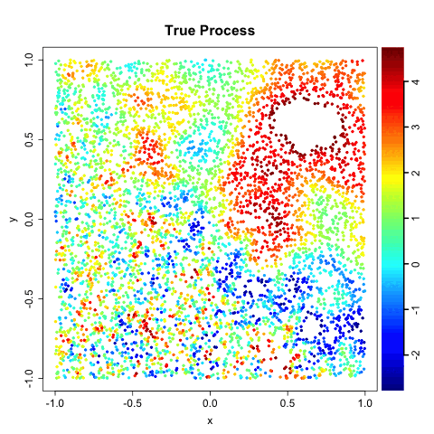
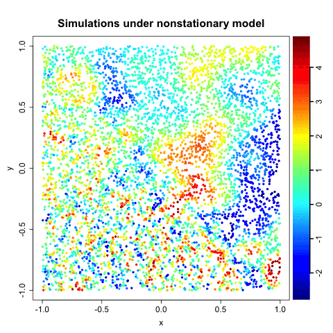
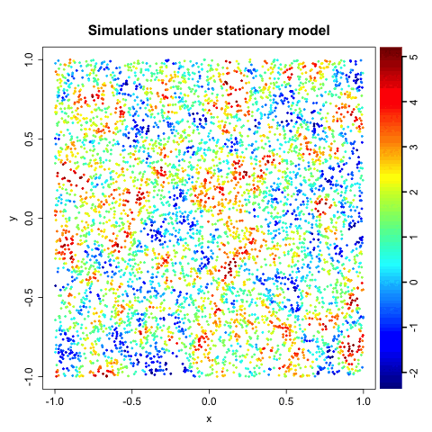

`cocons`
================================================================================
 


[](https://cran.r-project.org/web/checks/check_results_cocons.html)
[](https://CRAN.R-project.org/package=cocons)
[](http://www.gnu.org/licenses/gpl-3.0.html)
[](https://codecov.io/gh/blasif/cocons)

R package for nonstationary spatial modeling, simulation, and prediction of Gaussian processes with modular covariate-based covariance functions.

<!-- set width, height, or both -->
  

For a brief introduction:
``` R
  install.packages("cocons")
  library(cocons)
  vignette("cocons")
```

or you can check the vignette directly [here](https://github.com/blasif/cocons/blob/main/inst/doc/cocons.pdf).

For a description of the class of modular covariate-based covariance functions implemented in this package, please check the following [article](https://arxiv.org/abs/2410.16716#).

**Bugs and/or errors?:** feel free to add new issues on [https://github.com/blasif/cocons/issues](https://github.com/blasif/cocons/issues).
